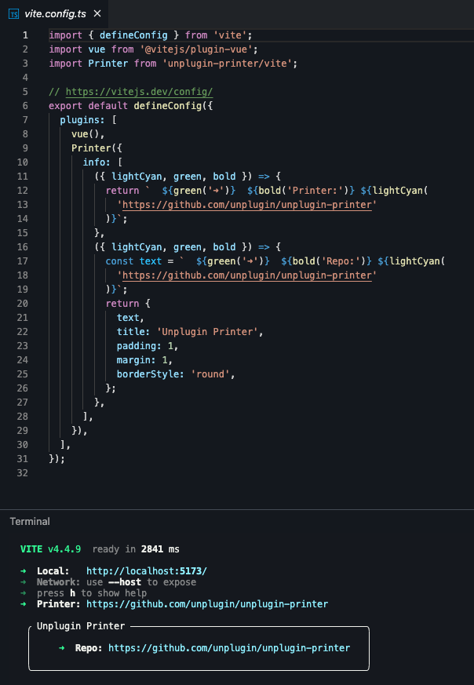

# unplugin-printer

<!-- <p align="center">
  <a href="https://www.npmjs.com/package/unplugin-printer" target="_blank" rel="noopener noreferrer"></a>
 <a href="https://github.com/webfansplz/unplugin-printer/blob/main/LICENSE" target="_blank" rel="noopener noreferrer"></a>
</p> -->

<p align="center">

</p>

<p align="center">
<a href="https://stackblitz.com/edit/unplugin-printer-vite?file=vite.config.ts&view=editor"></a>
</p>


## Install

```bash
npm i unplugin-printer
```

<details>
<summary>Vite</summary><br>

```ts
// vite.config.ts
import Printer from 'unplugin-printer/vite'

export default defineConfig({
  plugins: [
    Printer({ /* options */ }),
  ],
})
```

Example: [`playground/`](./playground/)

<br></details>

<details>
<summary>Webpack</summary><br>

```ts
// webpack.config.js
module.exports = {
  /* ... */
  plugins: [
    require('unplugin-printer/webpack')({ /* options */ })
  ]
}
```

<br></details>

<details>
<summary>Nuxt</summary><br>

```ts
// nuxt.config.js
export default defineNuxtConfig({
  modules: [
    ['unplugin-printer/nuxt', { /* options */ }],
  ],
})
```

> This module works for both Nuxt 2 and [Nuxt Vite](https://github.com/nuxt/vite)

<br></details>

<details>
<summary>Vue CLI</summary><br>

```ts
// vue.config.js
module.exports = {
  configureWebpack: {
    plugins: [
      require('unplugin-printer/webpack')({ /* options */ }),
    ],
  },
}
```

<br></details>

